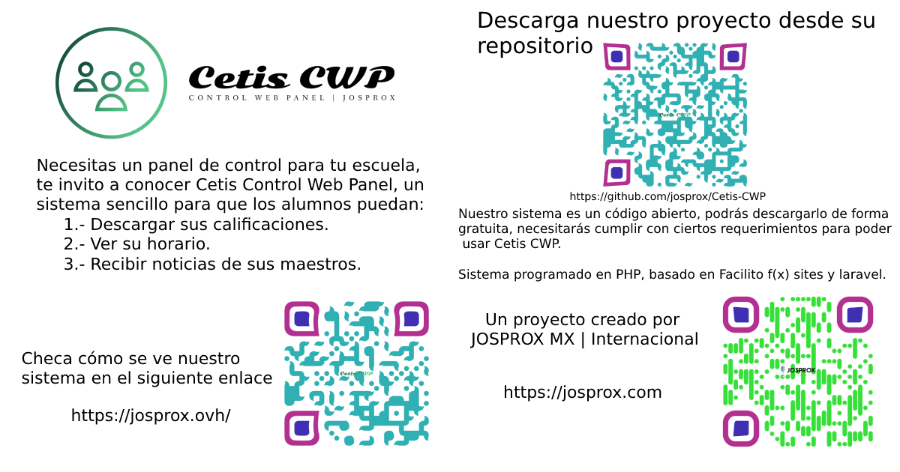

# Cetis Control Web Panel

## Misión

¿Estás buscando un sistema de control para alumnos? este proyecto es el que necesitas pues, los profesores podrán enviar notificaciones a los alumnos si tienen alguna tarea, sino podrá asistir, etc. Pero lo más importante, podrás decidir quién puede registrarse, el sistema se maneja con "Números de Control", solo con aquellos números podrán registrarse.

El usuario "admin", podrá interactuar con la información de los maestros y sus publicaciones, podría agregar números de control, corregir la información tanto del alumno cómo del maestro, crear anuncios hacia los maestros y muchas más cosas.

Este sistema está programado en PHP.

## Cetis CWP ocupa los siguientes frameworks para existir:

- Facilito F(x) sites creado por JOSPROX MX | Internacional: Este framework dá la estructura para el panel del alumno y maestro (back-end), conectado hacia la base de datos y leyendo cada tabla necesaria para mostrarle información tanto al alumno (usuario) cómo al maestro.

- Laravel con livewire: Le permite al administrador poder crear, leer, actualizar o eliminar datos de las tablas que aporta la base de datos (CRUD).

## El diseño de Cetis CWP está basado en:

- Facilito F(x) creado por JOSPROX MX | Internacional: ¿Estás buscando una forma de programar de una manera fácil? te presentamos nuestros diseños totalmente responsivos.

- Bootstrap creado por Mark Otto y Jacob Thornton: es una biblioteca multiplataforma o conjunto de herramientas de código abierto para diseño de sitios y aplicaciones web.

- Otros diseñadores desconocidos.

### Usuarios precargados:

    Laravel ("./admin/"):
        usuario: joss@int.josprox.com
        Contraseña: Andyyyo12?
    
    Alumnos ("./"):
        usuario: josprox
        Contraseña: Andyyyo12?
    
    Maestros ("./maestros/"):
        usuario: emma
        Contraseña: 123

        usuario: puff
        Contraseña: 123

        usuario: norma
        contraseña: 123

### Para poder usar Cetis CWP necesitará algunos requisitos mínimos:

- Versión mínima requerida de PHP: 8.0.1

- Espacio requerido en disco: 188 mb. 

- Transferencia de red requerida del servidor: 5 mb.

- Protocolo de transferencia recomendado: SFTP (SSHFTP) ó FTPS (FTPSSL).

### Instalación:

Descarga el archivo comprimido y guardalo en una raíz de documentos de tú servidor. Si ocupas XAMPP puede ser:
C:\xampp\htdocs\
Donde creamos una carpeta llamada Cetis CWP:
C:\xampp\htdocs\cetis cwp\

Ahora para poder empezar a usarlo deberás:

- Crear una base de datos.

- importar el archivo SQL que viene en la descarga.

- Modificar el archivo "./ps-conexion/base_db.php" con los datos correspondientes para poder llevar una conexión exitosa.

Listo, desde ahora podrás correr de una manera segura Cetis CWP.